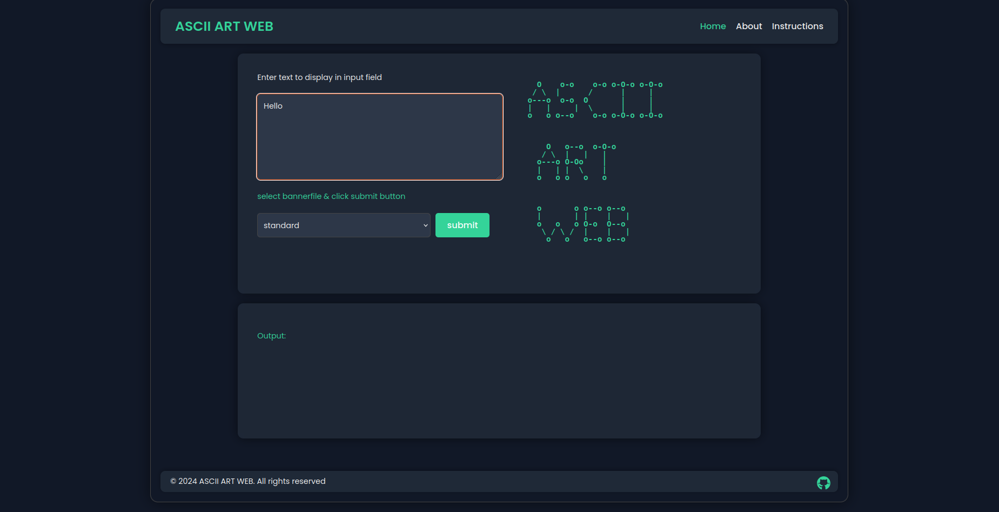
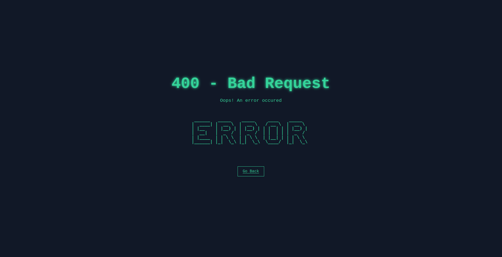
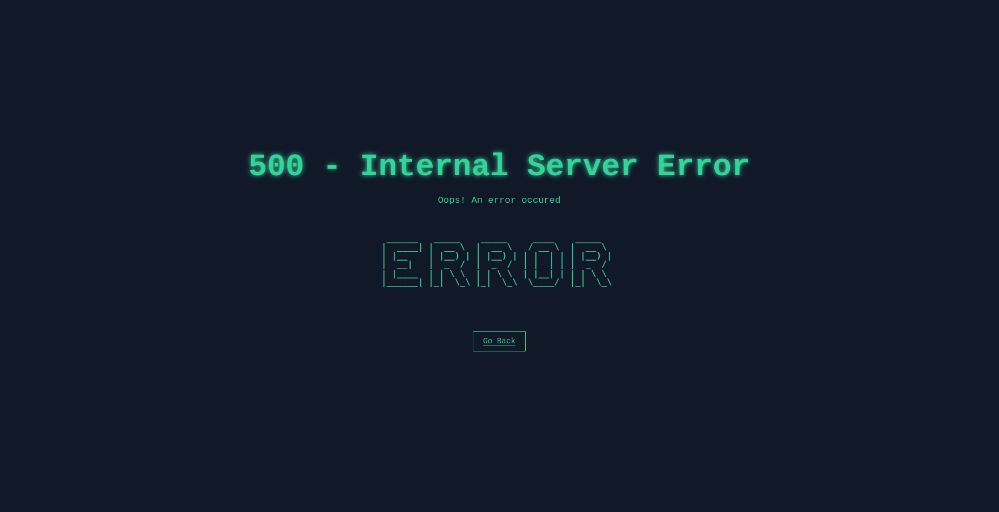
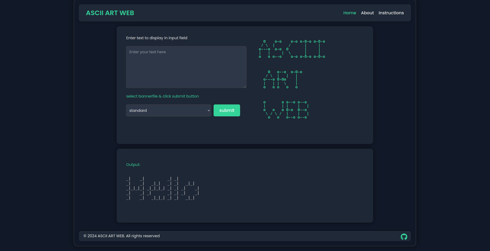

# ASCII-ART WEB

ASCII Art Web is a dynamic web application that allows users to create ASCII ART.It consists of creating and running a server by which a web-based GUI (graphical user interface) implementation of the previous project ascii-art.


# TABLE OF CONTENT

- [Introduction](#Introduction)
- [Usage](#Usage)
- [Implementation](#implementation-detail:algorithm)
- [Authors](#author)


## Introduction
Ascii-art Web is a project that hosts webpages for users to generate Ascii-Art of their desired text with their desired banner. The user is presented an area for them to type their desired text. If the character is among the printable ASCII character range  it is displayed this includes,numerics and symbols.

### Features 
+ Convert text to ASCII art using varius banner files
+ Interactive web interface for  creating ASCII art.
+ Responsive design for desktop and mobile devices.


## Installation 

Download the Go installer from the official [Go website](https://go.dev/doc/install).

Follow the installation instructions for your specific operating system.

Verify your installation by opening a command prompt and typing `go --version`. This should print the installed version of Go.


To set up ASCII Art Web locally, follow these steps:
```bash
# Clone the repository
git clone https://learn.zone01kisumu.ke/git/shfana/ascii-art-web.git

# Navigate to the project directory
cd ascii-art-web

# Install dependencies

`sudo apt install go -all`

# Start the ascii-web server
go run .
```

## Usage
After installation, you can access the web application by navgating to [http://localhost:8080](http://localhost:8080)


You will receive the following message on your terminal
```bash
Server is starting at http://localhost:8080
```

 

- These are the various parts of the home page 


 + Navbar - The navbar links to other pages of the application

 + The Input section - where the user keys in the input they want to generate to art

 + banner selection - The user has three options of banner files to choose from. (shadow, thinkertoy and standard)

 + The submit button - The user presses this button to generate the art that is displayed in the output section.

 + The footer  - This section contains the copyright disclaimer and an icon that has a  link to the repository.


The user can select one of the three available fonts/banner files to display their input in art form.

This project comes with three predefined ASCII fonts, located in banner files:

  - [`shadow`](https://learn.zone01kisumu.ke/git/root/public/src/branch/master/subjects/ascii-art/shadow.txt)
  - [`standard`](https://learn.zone01kisumu.ke/git/root/public/src/branch/master/subjects/ascii-art/standard.txt)
  - [`thinkertoy`](https://learn.zone01kisumu.ke/git/root/public/src/branch/master/subjects/ascii-art/thinkertoy.txt)


**- Each character is represented over 8 lines, providing a clear and sizable output.**

**- Characters are separated by a new line `\n`.**

### Creating ASCII Art

   1. Enter your desired text in the input field
   2. Select a banner style from the dropdown menu
   3. Click "Generate" to create your ASCII art


- From the example where the user has typed "hello" in the input field and selected  the `standard` banner. 
- The output should be shown as seen in the image below


- In the case of input `Hello` and `shadow` banner selected, the output is as shown below


- In the case of input `Hello` and `thinkertoy` banner selected.


- Output is as shown below


- Bad Requests: They occur when

    - The user does not give an input
    - The user gives an input that is not within the printable ASCII character range (from space to tide `~`). There are 95 characters in total

An example of a bad request is shown below(the user tries to input chinese characters or emojis)


The Following error is returned.


The user can click `go back` to return home to try using the program again


- In the case where a user tries to navigate to a non existent page or use a banner file that is not  available, he/she gets a 404 not found error 


- Internal server error occurs when an error occurs from the program and is not a user error.


## Implementation detail: algorithm

Once you run the program in the using the command `go run .` the program runs on a localhost server with the port provided. When you open the localhost provided you are directed to a page which resembles the image below. 



One the text box you enter the words you would like to be turned into word art. Then below it there is a dropdown option which helps you choose which type of bannerfile you can use. We have three options: shadow, thinkertoy and standard.
Once you have selected the banner file you can click on the submit button to get your word art. This issues a get request to the server which intern takes the word type in the text area and the bannerfile selected as the inputs. When the program is run the following variations of processes occur:

### Case 1: Print non-printable character.
If the character doesn't range between the ascii values 32-126 and is not '\n' or '\t' then it is considered as a bad error and an error message is printed out.



### Case 2: Trying to run invalid page.
If the user tries to run a page that is not available then a 404 not found error message is printed


### Case 3: Any other error
If the program encounters any error that is not specified, it returns an error message 500 internal server error.



### Case 4: printable charachter.
If the character is printable then it will issue a POST request t the server to return the result of the program to the output textbox.



When running the program one of the four will always occur deppending on what you have issued to the program.


## Stlying the website

The styling of the website is contained in the `static` folder that has 2 files  `err.css` and `styles.css`.


### (i) err.css

   This stylesheet was used to style the error page
   
   Here is an overview of how it was achieved.

**1. Global Styles**
 **Body and HTML:**
- Resetting Margins and Padding: Removed default margins and padding for a clean layout.

- Full-Height Layout: Ensured the content occupies the full viewport height.

- Font: Used 'Courier New', monospace for a retro, console-like look.

- Background and Text Color: A dark background (#111827) with neon green text (#34d399) for a futuristic feel.

- Overflow: Hidden to prevent scrolling, keeping everything in view.

**2. Container Styling**

- Centering Content: Used flexbox to center the content both horizontally and vertically. 

  The container is set to a column layout, with everything aligned in the center.

**3. Heading (h1)**
- Large Font Size: Set to 4em for a prominent display.
  
- Text Shadow: Added a neon-like glow effect using a soft green shadow.

**4. Paragraph (p)**

- Font Size: Slightly smaller than the heading, set to 1.2em.
- Margin: Added spacing above and below to separate the text.

**5. ASCII Art (#ascii-art)**

 - Font and Spacing:
       
    + Used monospace to maintain the ASCII art's alignment.
    + Set white-space: pre to preserve the formatting of the ASCII art.
    + Increased the font weight for a bolder look.

**6. Back Button (#back-button)**

    Button Styling:
        Simple and minimalistic with padding and a border.
        Colors match the page's theme, with a neon green border and text.
        Hover Effect: Reverses the colors on hover to provide visual feedback.

**7. Responsive design for Error Page**

 - Overflow Management:
        Changed overflow from hidden to auto on body and html to allow vertical scrolling on smaller screens.

 - Container Adjustments:
        Added padding to .container for better spacing on small screens.

 - Font and Element Size Scaling:
        Reduced h1 font size from 4em to 2.5em for smaller screens.
        Resized paragraph text (p) from 1.2em to 1em.
        Decreased #ascii-art font size to 14px and added overflow-x: auto for horizontal scrolling.

 - Button Adjustments:
        Reduced #back-button padding and font size to better fit smaller screens.

 - Media Query Implementation:
        Added a media query for screens with a max-width of 500px to apply all the above changes.

 ### (ii) styles.css
    Handles the styling used for the home, aboutr and instructions page. Here is an overview of how this was achieved.

**1. Global and Body Styling**

 - Font and Color: The body uses 'Poppins', Arial, sans-serif for a modern and clean look, with a consistent font size of 18px. The text color is set to a light shade (#f0f0f0), while the background is a dark shade (#111827).
 - Box Sizing and Padding: box-sizing: border-box ensures padding and borders are included in the element's total width and height, with 20px padding for spacing.

**2. Main Container (.content-wrapper)**

 - Layout and Spacing: The main content wrapper is centered with a max-width of 1200px, a flexible width, and padding. It has a flex-column layout, making it easy to stack elements vertically.
 - Borders and Shadows: A 2px solid #444 border with a 15px border-radius and box-shadow adds depth to the container.

**3. Navbar**

 - Flex Layout: The navbar uses flexbox to distribute items evenly, with the logo on one side and navigation links on the other.
 - Styling: The background is dark (#1f2937), with a soft shadow and rounded corners for a polished look. The logo is highlighted in mint green (#34d399).

**3. Form and Output Sections (.container, .form-container, .output-section)**

 - Responsive Design: The form and output sections are designed to be flexible, with padding, rounded corners, and box shadows. The input elements (like input, select, textarea) have a consistent design with borders, rounded corners, and background colors that match the dark theme.
 - Text Areas: Text areas are styled for readability, with adjustable height and a focus on maintaining the overall color scheme.

**4. Footer**

- The footer uses a similar dark background with light text, flexbox for layout, and a shadow for depth. The GitHub icon is styled to match the page's theme.

**5. Page-Specific Styling**

 - ASCII Art (.ascii-art): Styled with a monospace font for alignment and mint green text for contrast. This element is responsive, with font size adjustments based on screen size.
 
 - Instructions and About Pages:
    + Instructions Page (.instruction-step, .tip, .ascii-table): Instructions are presented in clearly defined sections with a dark background and rounded corners. Tips and ASCII tables have distinct borders and padding for emphasis.

 - About Page (.sections, .team-member): Team members are displayed in a grid layout with responsive behavior. Hover effects are applied for interactivity, scaling the elements slightly.

**6. Responsive Design**

 - Media Queries: The CSS includes breakpoints for screens max-width: 1100px and max-width: 600px. Adjustments include font resizing, reflowing of navigation links, and making containers more compact for smaller screens.
 


## Contribution

Contributions are welcome. Please adhere to the existing coding standards and include unit tests for any new features or changes. Ensure to thoroughly test the code before pushing any updates.
If you encounter any issues or have suggestions for improvement, feel free to submit an issue, pull request or propose a change!


Please follow these steps to contribute:

   1. Fork the repository
   2. Create a new branch (git checkout -b feature/AmazingFeature)
   3. Commit your changes (git commit -m 'Add some AmazingFeature')
   4. Push to the branch (git push origin feature/AmazingFeature)
   5. Open a Pull Request


## License
This Program is under the **MIT** Licence see [LICENSE](/LICENSE) for details.

## Authors
This program was built and maintained by 
- [cliffootieno](https://learn.zone01kisumu.ke/git/cliffootieno)
- [wnjuguna](https://learn.zone01kisumu.ke/git/wnjuguna)
- [shfana](https://learn.zone01kisumu.ke/git/shfana)